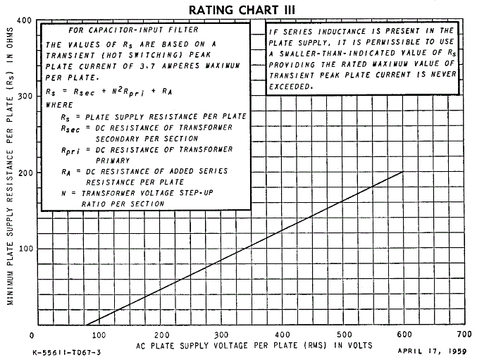
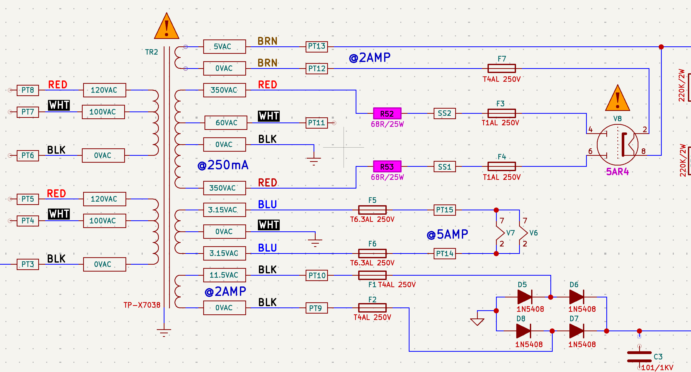
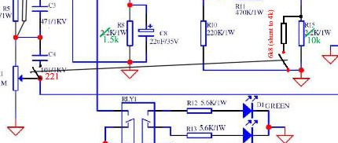

# Epiphone Blues Custom 30 modifications

## A compact guideline

## Version history

| Version Nr | Version Date | Modification                              |
|------------|--------------|-------------------------------------------|
| 1.0.0      | 2020-01-06   | Initial version for external distribution |

Table 1. Version History

# Introduction

## 1. General feature set

- Ampplifier with an "all tube" signal path
- Tube rectifier
- Two distinct channels
- 3 way equalizer
- Overdrive channel mid control
- Independent and interactive EQ mode
- Tube powered and transformer driven reverb
- 30W class AB (pentode) mode
- 15W Class A (triode) mode
- Multiple speaker output jacks (2x4 Ohm, 2x8 Ohm, 1x16 Ohm)
- "Lady Luck" speakers specially designed for this amplifier

## 2. Overall desired improvements

- Overall "harsh" clean and overdriven sounds
- Perceived as "too bright" with lack of bottom end
- Not switchable between clean and overdriven channel without tweaking
  the EQ settings

## 3. Dismantling instructions

To remove the chassis do the following

1.  Remove the mains power cable
2.  Remove the guitar cable from the input
3.  Remove the speaker cable from the output
4.  Remove the reverb RCA cables from the underside of the chassis
5.  Pry off the 4 plastic covers on top of the amp with a small flat
    blade screwdriver
6.  Remove the machine screws with a \#2 phillips screwdriver
7.  Grab the HT and OT and gently pull out while lifting up
8.  Connect one lead of an alligator clip to the chassis, and the other
    end to the common of a multimeter. probe the power tube solder
    joints making sure to leave one hand in your pocket and confirm the
    meter reads 0V

## 4. Affected components

### 4.1. Capacitors

| Component | Identification | Actual Value | Modification                              | Expected result |
|-----------|----------------|--------------|-------------------------------------------|-----------------|
| **C3**    | 471/1kV        | 470pF/1000V  | Unsolder or cut off                       |                 |
| **C4**    | 101/1kV        | 100pF/1000V  | Unsolder or cut off                       |                 |
| **C5**    | 471/400V       | 470pF/400V   | Unsolder or cut off                       |                 |
| **C6**    | 101/1kV        | 100pF/1000V  | Unsolder or cut off                       |                 |
| **C10**   | 471/1kV        | 470pF/1000V  | Unsolder or cut off                       |                 |
| **C15**   | 22µF/35V       |              | Replace 2.2µF/35V                         |                 |
| **C16**   | 471/1kV        | 470pF/1000V  | Increase to 680pF : put 220pF in parallel |                 |

### 4.2. Resistors

| Component | Identification | Modification                                                        | Expected result |
|-----------|----------------|---------------------------------------------------------------------|-----------------|
| **R3**    | 2.2kΩ/1W       | Replace 1kΩ/1W or shunt with 2.2kΩ for 1.1kΩ                        |                 |
| **R5**    | 1MΩ/1W         | Shunt with 820kΩ for 450kΩ                                          |                 |
| **R6**    | 1MΩ/1W         | Shunt with 820k for 450kΩ                                           |                 |
| **R8**    | 2.2kΩ/1W       | Replace 1kΩ/1W or shunt with 2.2kΩ for 1.1kΩ                        |                 |
| **R15**   | 2.2kΩ/1W       | Replace 1.6kΩ/1W or shunt with 5.6kΩ for 1.58kΩ                     |                 |
| **R21**   | 2.2kΩ/1W       | Replace 1kΩ/1W or shunt with 2.2kΩ for 1.1kΩ                        |                 |
| **R23**   | 10kΩ/1W        | Replace 5.6kΩ/1W or shunt with 12kΩ for 5.45kΩ                      |                 |
| **R39**   | 220kΩ/1W       | Replace 1MΩ linear potentiometer                                    |                 |
| **R52**\* | 68Ω/25W        | Put in between 350V line and PCB. Mount against chassis for cooling |                 |
| **R53**\* | 68Ω/25W        | Put in between 350V line and PCB. Mount against chassis for cooling |                 |

## 5. Detailed findings

### 5.1. Capacitors

#### 5.1.1. C3

- **Stock value**: 470pF/1000V
- **Action**: unsolder or cut off
- **Affects**: Clean channel
- **Perceived result**:
  - Cuts brightness off
  - Clean channel sounds less treble-y. easier to manage

#### 5.1.2. C4

- **Stock value**: 470pF/1000V
- **Action**: unsolder or cut off
- **Affects**: Clean channel
- **Perceived result**: Cuts brightness off

#### 5.1.3. C5

- **Stock value**: 470pF/400V
- **Action**: unsolder or cut off
- **Affects**: Both channels. Cuts brightness off
- **Perceived result**:

#### 5.1.4. C6

- **Stock value**: 100pF/1000V
- **Action**: unsolder or cut off
- **Affects**: Both channels. Cuts brightness off
- **Perceived result**: Drive channel now sounds more like a fizzy
  distortion rather than a crunchy overdrive

#### 5.1.5. C10

- **Stock value**: 470pF/1000V
- **Action**: unsolder or cut off
- **Affects**: Both channels. Cuts brightness off
- **Perceived result**: lost way too much top end

##### C15

- **Stock value**: 22uF/35V
- **Action**: replace 2.2uF/35V
- **Affects**: overdrive channel
- **Perceived result**: makes the whole amp brighter, less bottom end.

#### 5.1.6. C16

- **Stock value**: 470pF/1000V
- **Action**: increase to 680pF, put capacitor in parallel
- **Affects**:
- **Perceived result**:

### 5.2. Resistors

#### 5.2.1. R3

- **Stock value**: 2.2kΩ/1W
- **Action**: replace 1k/1W
- **Affects**: ?
- **Perceived result**:?

#### 5.2.2. R5

- **Stock value**: 1MΩ/1W
- **Action**: shunt with 820kΩ/1W
- **Affects**: Drive channel
- **Perceived result**:
  - The fundamental pass frequency is halved
  - Potential divider is halved (more signal to next stage)
  - The sound opens up with increased bass but no loss of top end, not
    dark and not harsh

#### 5.2.3. R6

- **Stock value**: 1MΩ/1W
- **Action**: shunt with 820kΩ/1W
- **Affects**: Drive channel
- **Perceived result**:
  - The fundamental pass frequency is halved
  - Potential divider is halved (more signal to next stage)
  - The sound opens up with increased bass but no loss of top end, not
    dark and not harsh

#### 5.2.4. R8

- **Stock value**: 2.2kΩ/1W
- **Action**: replace 1kΩ/1W
- **Affects**: Drive channel
- **Perceived result**: ?

#### 5.2.5. R15

- **Stock value**: 2.2kΩ/1W
- **Action**: replace 1.6kΩ/1W
- **Affects**: Drive channel
- **Perceived result**:
  - Smoother overdrive : affects overdrive channel
  - Lowered gain → ???
  - Distortion is a bit smoother and not so harsh
  - Really mellows out the channel drive
  - The drive is more manageable
  - Is the best sounding, most noticeable among the mods mentioned.
  - Unbelievable difference. That gain boost brought some fire into the
    tone. Gain was nicely saturated & balanced.

#### 5.2.6. R23

- **Stock value**: 10kΩ/1W
- **Action**: replace 5.6kΩ/1W
- **Affects**: ?
- **Perceived result**: ?

#### 5.2.7. R39

- **Stock value**: 220kΩ/1W
- **Action**:
  - Replace by 1MΩ potentiometer
  - Place potentiometer in front panel of the chassis
  - Wire to PCB with shielded signal cable
- **Affects**: Volume control improvement of clean channel
- **Perceived result**:
  - Better control of clean channel volume
  - Clean channel can be cranked up and controlled by master volume knob

#### 5.2.8. R52
- **Stock value**: not existing
- **Action**:
  - Put in between 350V AC lead of transformer and SS2 on the PCB
- **Affects**: Protects against transformer blow-up
- **Perceived result**: None. Increases robustness of amplifier

#### 5.2.9. R53

- **Stock value**: not existing
- **Action**:
  - Put in between 350V AC lead of transformer and SS1 on the PCB
- **Affects**: Protects against transformer blow-up
- **Perceived result**: None. Increases robustness of amplifier

Figure 1. Limiting resistance calculation graph

It is worth noting that the choke will slightly lower the required
limiting resistance, but not by much. The above datasheet chart provides
the calculation necessary to determine the limiting resistance provided
by the transformer:

Rs = Rsec + N2Rpri

measured Rpri is 5.5R and Rsec is 37.5R (75R for the entire winding) so…
Transformer ratio N = 350 / 240 = 1.45 so…

37.5 + (1.45 \* 1.45 \* 5.5) = 49R

The chart shows that for a 350V tap, the limiting resistance needs to be
around 105R for EACH PLATE of the rectifier, and this is for a fresh
valve manufactured to 1959 standards. So lets assume 115R will be safer
for modern 5AR4s,

115R - 49R = 66R

68R is the nearest standard resistor, two of these should be chassis
mounted inside the amp, and the transformer secondary taps (350V) should
be wired directly to these and then the other ends of the resistors
wired to the PCB. 25W types are recommended, as the voltage rating
should be in the region of 550V. The working voltage in practice will be
much much lower than this but at the moment of power on, it will be
higher and it’s nice to know that nothing can go wrong!

BTW, using the standby switch makes the problem worse because the
rectifier is fully ready to conduct. If you are unlucky enough to flip
the switch at the moment the mains AC voltage is at it’s peak then
destruction is almost guaranteed. Starting the amp from cold (without
the standby) will slightly reduce the likelihood of failure. So, for a
happy BC30, don’t use the standby and install limiting resistors!

Figure 2. Limiting resistors of 68Ω

### 5.3. Tried out combinations and their findings

<table>
<td class="content">C5,C6,C10,R15 
<strong>This amp is singing now 
</strong> Much more manageable/tweak-able</td>
</table>

<table>
<td class="content">C3,C5,C6,R15 
In that order you’ll hear the difference</td>
</table>

<table>
<td class="content">C3,C5,C6,C15,R15,R21 
<strong>These mods really open this amp up 
</strong> EQ is way more definable between active and not 
** More use out of the mid channel</td>
</table>

<table>
<td class="content">C3,C5,C6,R15,R21,C15 
<strong>The thing now sounds great 
</strong> EQ is extremely effective and sensitive 
<strong>Has more gain but it is by no means a 'high gain' amp 
</strong> Bigger sound and more responsive to touch 
</td>
</table>

### 5.4. Other modifications

#### 5.4.1. Remove standby switch SW4

- Use the whole for master volume mod

#### 5.4.2. "Fat Gain" switch

Figure 3. Fat gain switch

- Use a DPDT (Double Pole, Double Throw) switch

#### 5.4.3. Other recommendations

- Tidy all wirings
- Re-valve Rectifier replacement

#### 5.4.4. Pre-amp Tube recommendations

- Ei ECC83
- RCA
- Mullard
- Telefunken
- JJ ECC83

- **V1, V2**: Harma ECC83 Retro (Mullard rebuild)
- **V3, V5**: (reverb) Stock EH so far

#### 5.4.5. Phase inverter recommendations

- **V4**: (PI) Harma ECC83 Retro - balanced

#### 5.4.6. Output valve recommendations

- Tungsol 5881
- Svetlana 6L6
- JJ Electronic 5881
- Groove Tube 5881
- NOS Philips JAN 6L6WGB/5881
- Svetlana=C= 6L6GC

#### 5.4.7. Reverb drive valve recommendations

- Sovtek 5AR4

### 5.5. Other hardware

#### 5.5.1. Output transformer and choke

- Mercury Magnetics is selling a replacement output transformer and
  choke

## 6. Links

- [Mercury
  Magnetics](https://www.mercurymagnetics.com/products/?swoof=1&filter_make=epiphone&filter_model=blues-custom&filter_product-type=all)

- [Switch types](https://en.wikipedia.org/wiki/Switch)

- [forum
  discussion](https://www.tdpri.com/threads/anyone-try-the-new-epiphone-blues-custom.54114/)

Last updated 2020-01-06 20:42:20 +0100