# Servo Controlled Master Volume
### Beschrijving & Functie
* Deze controller fungeert als de mechanische interface tussen de Boss GT-5 expressiepedaal en de fysieke master volume van een Epiphone Custom Blues 30 versterker.
* Het systeem vertaalt in de MIDI-modus inkomende Control Change data naar nauwkeurige hoekverdraaiingen van een servo-motor die de potmeter op de versterker fysiek bedient.
* Via een centrale microprocessor wordt continu gecontroleerd of de gebruiker de voorkeur geeft aan externe MIDI-automatisering of aan de lokale manuele modus via de ingebouwde potmeter.
* De gebruiker kan met een modusschakelaar direct wisselen tussen deze twee operationele standen om de gewenste bron van controle te bepalen.
* De programmeerbare instelmodus maakt het mogelijk om met een enkele drukknop de kritieke fysieke stop-punten van de servo-motor nauwkeurig te kalibreren voor de specifieke potmeter-range.
* Tijdens dit proces worden de ondergrens en bovengrens via een sequentiële klik-methode gedefinieerd, waarbij een status-LED met specifieke flitspatronen de bevestiging van elke stap weergeeft.
* Alle gekalibreerde parameters worden direct weggeschreven naar het EEPROM-geheugen van de Arduino, waardoor de fysieke grenswaarden na een stroomonderbreking onmiddellijk weer actief zijn.
* Deze hybride opzet garandeert dat de analoge buizenversterker kan profiteren van moderne digitale expressie-controle zonder dat de interne circuits elektrisch gemodificeerd hoeven te worden.
* Door de mechanische koppeling tussen de servo en de master volume potmeter blijft de integriteit van het audiosignaal volledig behouden terwijl de dynamische controle over de output toeneemt.
* De controller zorgt hiermee voor een naadloze integratie van vintage versterkertechniek met de precisie van moderne MIDI-gestuurde effectenbakken en pedalen.

